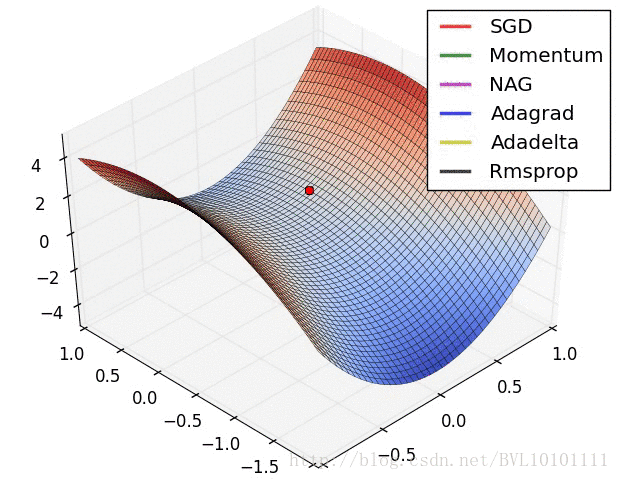
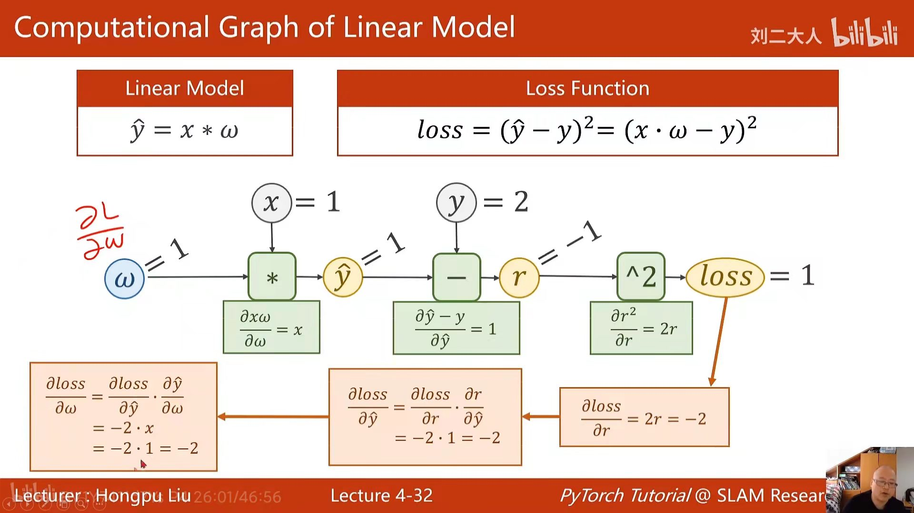

线性模型和梯度下降
=====
[TOC]


## 线性回归

### 1.1 模型表示


**以预测住房价格为例：**


**我们用小写的 $m$ 来表示训练样本的数目,数据集如下表所示：**


描述这个回归问题的标记如下:

- $\pmb{m}$： 代表训练集中实例的数量
  
- $\pmb{x}$： 代表特征/输入变量

- $\pmb{y}$： 代表目标变量/输出变量

- $\left( \pmb{x,y} \right)$：代表训练集中的实例

- $(\pmb{{{x}^{(i)}},{{y}^{(i)}}})$：代表第$i$ 个观察实例

- $\pmb{h}$：代表学习算法的解决方案或函数也称为假设（**hypothesis**）


我们把训练集喂给我们的学习算法，学习算法的工作了，然后输出一个函数，通常表示为小写 $h$  表示。$h$  代表**hypothesis**(**假设**)，$h$表示一个函数，输入是房屋尺寸大小， $h$ 根据输入的 $x$值来得出 $y$ 值，$y$ 值对应房子的价格 因此，$h$ 是一个从$x$ 到 $y$ 的函数映射。


表达方式为：
$$h_\theta \left( x \right)=\theta_{0} + \theta_{1}x$$
因为只含有一个特征/输入变量，因此这样的问题叫作单变量线性回归问题。

### 1.2 损失函数

如图：


我们要为我们的模型选择合适的**参数**（**parameters**）$\theta_{0}$ 和 $\theta_{1}$，在房价问题这个例子中便是直线的斜率和在 $y$ 轴上的截距。

我们选择的参数要使得模型预测值与训练集中实际值之间的差距尽可能小
（下图中蓝线所指）


我们的目标便是选择出可以使得这种差距能够最小的模型参数。 
即使得损失函数最小
$$J \left( \theta_0, \theta_1 \right) = \frac{1}{2m}\sum\limits_{i=1}^m \left( h_{\theta}(x^{(i)})-y^{(i)} \right)^{2}$$


我们绘制一个等高线图，三个坐标分别为$\theta_{0}$和$\theta_{1}$ 和$J(\theta_{0}, \theta_{1})$：


则可以看出在三维空间中存在一个使得$J(\theta_{0}, \theta_{1})$最小的点。


### 1.3 梯度下降


我们将使用梯度下降算法来求出损失函数 $J(\theta_{0}, \theta_{1})$ 的最小值。

**梯度下降背后的思想是**：
- 开始时我们随机选择一个参数的组合$\left( {\theta_{0}},{\theta_{1}},......,{\theta_{n}} \right)$，计算损失函数，然后我们寻找下一个能让损失函数值下降最多的参数组合。我们持续这么做直到找到一个局部最小值（**local minimum**），因为我们并没有尝试完所有的参数组合，所以不能确定我们得到的局部最小值是否便是全局最小值（**global minimum**），**选择不同的初始参数组合，可能会找到不同的局部最小值。**


- **批量梯度下降（**batch gradient descent**）算法的公式为：**

$${\theta_{j}}:={\theta_{j}}-\alpha \frac{\partial }{\partial {\theta_{j}}}J\left(\theta \right)$$

其中:  
- $a$：是学习率（**learning rate**）
- $\frac{\partial }{\partial {\theta_{j}}}J\left(\theta \right)$：是损失函数的关于$ \theta_{j}$ 的梯度
  

**步骤**
- 对$\theta $赋值，使得$J\left( \theta  \right)$按梯度下降最快方向进行，一直迭代下去，最终得到局部最小值。其中$a$是学习率（**learning rate**），它决定了我们沿着能让代价函数下降程度最大的方向向下迈出的步子有多大。


### 1.4 学习率

梯度下降算法收敛所需要的迭代次数根据模型的不同而不同，我们不能提前预知，我们可以绘制迭代次数和损失函数的图表来观测算法在何时趋于收敛。


也有一些自动测试是否收敛的方法，例如将损失函数的变化值与某个阀值（例如0.001）进行比较，但通常看上面这样的图表更好。


- 如果$a​$太小了，即我的学习速率太小，结果就是只能一样一点点地挪动，去努力接近最低点，这样就需要很多步才能到达最低点，所以如果$a$太小的话，可能会很慢，因为它会一点点挪动，它会需要很多步才能到达全局最低点。
  

- 如果$a$太大，那么梯度下降法可能会越过最低点，甚至可能无法收敛，下一次迭代又移动了一大步，越过一次，又越过一次，一次次越过最低点，直到你发现实际上离最低点越来越远，所以，如果$a$太大，它会导致无法收敛，甚至发散。
- 通常可以考虑尝试些学习率：$\alpha=0.01，0.03，0.1，0.3，1，3，10$


我们来看一个例子，这是损失函数$J\left( \theta  \right)$。


- 在梯度下降法中，当我们接近局部最低点时，梯度下降法会自动采取更小的幅度，这是因为当我们接近局部最低点时，很显然在局部最低时导数等于零，所以当我们接近局部最低时，导数值会自动变得越来越小，所以梯度下降将自动采取较小的幅度，这就是梯度下降的做法。所以实际上没有必要再另外减小 $a$。
  
### 1.5 随机梯度下降
**我们再来看一幅图：**



- [鞍点](https://en.wikipedia.org/wiki/Saddle_point)
  鞍点（Saddle point）指一个非局部极值点的驻点。鞍点这词语来自于不定二次型 ${\displaystyle x^{2}-y^{2}\,}$的二维图形，像个马鞍：在x-轴方向往上曲，在y-轴方向往下曲
  
如果用传统的梯度下降法，我们模型的参数在鞍点处会停止更新，但是损失函数未达到局部最优点或全局最优点，因此，我们要用随机梯度下降法，使得模型参数在更新的时候越过鞍点。


### 1.4 反向传播
**如下图所示：**




### 1.5 梯度下降的线性回归


对我们之前的线性回归问题运用梯度下降法，关键在于求出损失函数的导数，即：

**$\frac{\partial }{\partial {{\theta }_{j}}}J({{\theta }_{0}},{{\theta }_{1}})=\frac{\partial }{\partial {{\theta }_{j}}}\frac{1}{2m}{{\sum\limits_{i=1}^{m}{\left( {{h}_{\theta }}({{x}^{(i)}})-{{y}^{(i)}} \right)}}^{2}}$**

**$j=0$  时：$\frac{\partial }{\partial {{\theta }_{0}}}J({{\theta }_{0}},{{\theta }_{1}})=\frac{1}{m}{{\sum\limits_{i=1}^{m}{\left( {{h}_{\theta }}({{x}^{(i)}})-{{y}^{(i)}} \right)}}}$**

**$j=1$  时：$\frac{\partial }{\partial {{\theta }_{1}}}J({{\theta }_{0}},{{\theta }_{1}})=\frac{1}{m}\sum\limits_{i=1}^{m}{\left( \left( {{h}_{\theta }}({{x}^{(i)}})-{{y}^{(i)}} \right)\cdot {{x}^{(i)}} \right)}$**

**则有：**

​                **${\theta_{0}}:={\theta_{0}}-a\frac{1}{m}\sum\limits_{i=1}^{m}{ \left({{h}_{\theta }}({{x}^{(i)}})-{{y}^{(i)}} \right)}$**

​                **${\theta_{1}}:={\theta_{1}}-a\frac{1}{m}\sum\limits_{i=1}^{m}{\left( \left({{h}_{\theta }}({{x}^{(i)}})-{{y}^{(i)}} \right)\cdot {{x}^{(i)}} \right)}$**


### 1.6多元线性回归


目前为止，我们探讨了单变量/特征的回归模型，现在我们对房价模型增加更多的特征，例如房间数楼层等，构成一个含有多个变量的模型，模型中的特征为$\left( {x_{1}},{x_{2}},...,{x_{n}} \right)$。


增添更多特征后，我们引入一系列新的注释：

**$n$** 代表特征的数量

**${x^{\left( i \right)}}$** 代表第 **$i$** 个训练实例，是特征矩阵中的第 **$i$** 行，是一个**向量**（**vector**）。

比方说，上图的

${x}^{(2)}\text{=}\begin{bmatrix} 1416\\\ 3\\\ 2\\\ 40 \end{bmatrix}$，

${x}_{j}^{\left( i \right)}$代表特征矩阵中第 $i$ 行的第 $j$ 个特征，也就是第 $i$ 个训练实例的第 $j$ 个特征。

如上图的$x_{2}^{\left( 2 \right)}=3,x_{3}^{\left( 2 \right)}=2$，

支持多变量的假设 $h$ 表示为：$h_{\theta}\left( x \right)={\theta_{0}}+{\theta_{1}}{x_{1}}+{\theta_{2}}{x_{2}}+...+{\theta_{n}}{x_{n}}$，

这个公式中有$n+1$个参数和$n$个变量，为了使得公式能够简化一些，引入$x_{0}=1$，则公式转化为：$h_{\theta} \left( x \right)={\theta_{0}}{x_{0}}+{\theta_{1}}{x_{1}}+{\theta_{2}}{x_{2}}+...+{\theta_{n}}{x_{n}}$

此时模型中的参数是一个$n+1$维的向量，任何一个训练实例也都是$n+1$维的向量，特征矩阵$X$的维度是 $m*(n+1)$。 因此公式可以简化为：$h_{\theta} \left( x \right)={\theta^{T}}X$，其中上标$T$代表矩阵转置。

### 1.7 多变量梯度下降


与单变量线性回归类似，在多变量线性回归中，我们也构建一个损失函数，则这个损失函数是所有建模误差的平方和，即：
$$J\left( {\theta_{0}},{\theta_{1}}...{\theta_{n}} \right)=\frac{1}{2m}\sum\limits_{i=1}^{m}{{{\left( h_{\theta} \left({x}^{\left( i \right)} \right)-{y}^{\left( i \right)} \right)}^{2}}}$$ 


其中：
$$h_{\theta}\left( x \right)=\theta^{T}X={\theta_{0}}+{\theta_{1}}{x_{1}}+{\theta_{2}}{x_{2}}+...+{\theta_{n}}{x_{n}}$$ 

我们的目标和单变量线性回归问题中一样，是要找出使得损失函数最小的一系列参数。
多变量线性回归的批量梯度下降算法为：

当$n>=1$时，
${{\theta }_{0}}:={{\theta }_{0}}-a\frac{1}{m}\sum\limits_{i=1}^{m}{({{h}_{\theta }}({{x}^{(i)}})-{{y}^{(i)}})}x_{0}^{(i)}$

${{\theta }_{1}}:={{\theta }_{1}}-a\frac{1}{m}\sum\limits_{i=1}^{m}{({{h}_{\theta }}({{x}^{(i)}})-{{y}^{(i)}})}x_{1}^{(i)}$

${{\theta }_{2}}:={{\theta }_{2}}-a\frac{1}{m}\sum\limits_{i=1}^{m}{({{h}_{\theta }}({{x}^{(i)}})-{{y}^{(i)}})}x_{2}^{(i)}$


我们开始随机选择一系列的参数值，计算所有的预测结果后，再给所有的参数一个新的值，如此循环直到收敛。

代码示例：

**Python** 代码：

```python
def computeCost(X, y, theta):
    inner = np.power(((X * theta.T) - y), 2)
    return np.sum(inner) / (2 * len(X))
```

### 1.9 特征缩放

在我们面对多维特征问题的时候，我们要保证这些特征都具有相近的尺度，这将帮助梯度下降算法更快地收敛。

以房价问题为例，绘制损失函数的等高线图，看出图像会显得很扁，梯度下降算法需要非常多次的迭代才能收敛。


解决的方法是尝试将所有特征的尺度都尽量缩放到-1到1之间。如图：


最简单的方法是令：${{x}_{n}}=\frac{{{x}_{n}}-{{\mu}_{n}}}{{{s}_{n}}}$，其中 ${\mu_{n}}$是平均值，${s_{n}}$是标准差。


